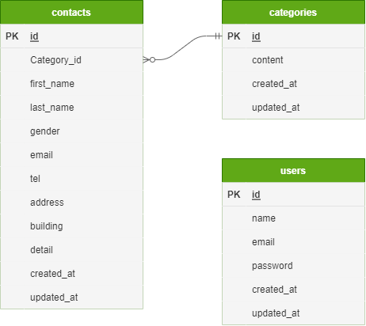

# お問い合わせフォーム

## 環境構築

### Dockerビルド

1. git clone git@github.com:teruma-nanami/ability-test
1. docker-compose up -d --build

### Laravel環境構築

1. docker-composer exec php bash
1. composer install
1. .env.example ファイルから.envを作成し、環境変数を変更
1. php artisan key:generate
1. php artisan migrate
1. php artisan db:seed

## 使用技術(実行環境)

- php 7.4.9
- Laravel 8.83
- MySQL 8.0

## ER図

## URL

- 開発環境：http://localhost/
- phpMyAdmin：http://localhost:8080/